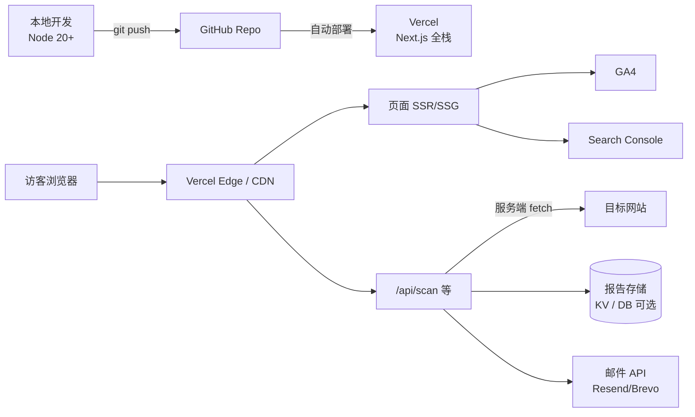
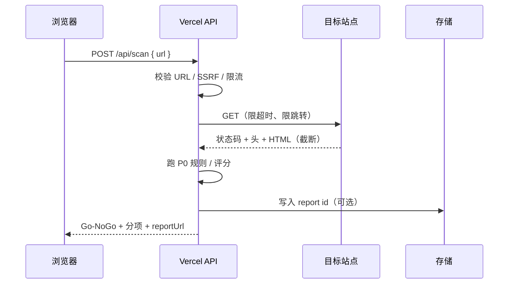

# 部署架构：Go-Live Site Clearance

| 字段 | 内容 |
|------|------|
| 关联 | [PRD.md](./PRD.md) §9 |
| 默认方案 | GitHub（代码）→ Vercel（运行） |
| 备用方案 | GitHub → Cloudflare Pages + Worker |
| V1 原则 | 不买云主机；GitHub Pages 不作为生产运行环境 |

---

## 1. 总览



**分工一句话：**

- **GitHub**：源码、PR、可选 CI  
- **Vercel**：跑前端页面 + 扫描 API +（可选）KV  
- **第三方**：邮件、分析、联盟  
- **不自建**：常驻 VPS / 自管 Nginx（V1）

---

## 2. 为什么不能「只在 GitHub 上跑」

| GitHub 能力 | 本产品是否够用 |
|-------------|----------------|
| 托管 Git 仓库 | ✅ 必须用 |
| Actions 做 lint/test | ✅ 建议用 |
| GitHub Pages 静态站 | ❌ 无服务端扫描，无法安全代请求目标站 |
| Codespaces | 仅开发环境，不当生产 |

扫描必须由**你的服务端**发起 HTTP 请求并读取响应头/HTML；浏览器直连目标站会撞 CORS，且读不全安全头。

---

## 3. 推荐架构（Primary）：GitHub + Vercel

### 3.1 仓库形态

单体 Next.js（App Router）同一仓库：

```text
/
├── app/                 # 页面（落地页、报告页）
├── app/api/scan/        # 扫描 API（服务端）
├── app/api/report/      # 报告读写（若需要）
├── lib/scan/            # 规则、SSRF、评分
├── content/ 或 MDX      # 落地页内容（可选）
└── package.json
```

前后端同仓同部署，降低低预算运维成本。

### 3.2 运行时职责

| 组件 | 跑在哪 | 职责 |
|------|--------|------|
| 营销/工具页 | Vercel（SSG/SSR） | SEO 落地页、首页表单 |
| `POST /api/scan` | Vercel Serverless / Fluid | SSRF 校验 → fetch 目标 → 规则引擎 → 返回 JSON |
| `/report/[id]` | SSR 或边缘读存储 | 可分享报告 |
| 静态资源 | Vercel CDN | JS/CSS/图 |

### 3.3 扫描链路（生产）



### 3.4 部署流程

```text
1. 代码 push 到 GitHub（main 或 production 分支）
2. Vercel Git Integration 触发 Build
3. next build 成功 → 自动切换 Production
4. 自定义域名在 Vercel 绑定（DNS：A/CNAME 按控制台）
```

预览：每个 PR 可有 Preview URL，方便测扫描与文案。

### 3.5 环境变量（Vercel Project Settings）

| 变量 | 用途 | 备注 |
|------|------|------|
| `NEXT_PUBLIC_SITE_URL` | 规范域名、OG、canonical | 生产填正式域名 |
| `SCAN_TIMEOUT_MS` | 扫描超时 | 建议 5000–8000 |
| `RATE_LIMIT_*` | IP 限流 | 或用平台/Upstash |
| `REPORT_KV_*` / `DATABASE_URL` | 报告持久化 | V1 可暂缓，先短时存储 |
| `RESEND_API_KEY` 等 | 邮件报告 | M2 再加 |
| `NEXT_PUBLIC_GA_ID` | 分析 | |

密钥只放 Vercel，**不进 Git**。

### 3.6 资源与限额（V1 预期）

| 项 | 建议 |
|----|------|
| 单次扫描时长 | 控制在 3–8s |
| 函数内存 | 默认即可（1024MB 内） |
| 并发 | 免费档够冷启动期；加 IP 限流 + 同 URL 短缓存（60–300s） |
| 出站 | 仅访问用户提交的公网 URL；禁私网 |

流量起来后再评估 Pro 或迁 Cloudflare。

---

## 4. 备用架构：GitHub + Cloudflare

当 Vercel 免费额度不够，或希望更贴边缘时：

| 层 | Cloudflare |
|----|------------|
| 页面 | Pages（Next 兼容模式或静态导出+少量动态） |
| 扫描 | Worker `fetch` 目标站（同类 SSRF/超时策略） |
| 存储 | KV 存报告 |
| 域名 | Cloudflare DNS |

逻辑与 Vercel 方案相同：**GitHub 存代码，平台跑函数**。V1 不必双端都做，选定一个即可。

---

## 5. 明确不采用的架构（V1）

| 方案 | 原因 |
|------|------|
| 仅 GitHub Pages | 无服务端扫描 |
| 自购云主机 + Nginx + PM2 | 成本与运维高于收益 |
| 前后端拆成两个仓库/两套服务器 | 过早复杂化 |
| 扫描放浏览器端 | CORS/头不全/SSRF 难控 |
| 无头浏览器（Playwright）全站爬 | 贵、慢，属 V2+ |

---

## 6. 安全与合规（部署层必须落地）

与 PRD 一致，上线前检查：

- [ ] URL 仅 `http:` / `https:`  
- [ ] DNS/IP 校验后拒绝 loopback、RFC1918、link-local、云 metadata  
- [ ] 超时、最大跳转次数、响应体大小上限  
- [ ] 按 IP（及可选按 URL）速率限制  
- [ ] 不长期存完整 HTML；报告有过期策略（如 7 天）  
- [ ] `User-Agent` 标明机器人身份与项目页/联系方式  
- [ ] robots/methodology 说明用途与局限  

---

## 7. 本地 / 预览 / 生产对照

| 环境 | 地址 | 扫描行为 |
|------|------|----------|
| Local | `localhost:3000` | API Route 本机出站；勿扫内网 |
| Preview | `*.vercel.app` | 与生产同逻辑；可用独立限流更严 |
| Production | 自定义域名 | 正式限流、正式邮件与联盟 ID |

---

## 8. 域名与 DNS

```text
例：clearance.example.com 或 yourproduct.dev

  DNS（注册商或 Cloudflare）
       CNAME / 按 Vercel 文档配置
            → Vercel 项目
```

- 证书：平台自动 HTTPS  
- `www` 与 apex：选一个规范站并 301  
- Search Console 验证挂在生产域名上  

---

## 9. CI 建议（可选但便宜）

GitHub Actions 示例职责（不必第一天就有）：

- `pnpm lint` / `pnpm test`（规则单测：SSRF、评分）  
- 不在 Actions 里对公网做压力扫描  

部署仍以 Vercel Git 集成为准，Actions 不替代托管。

---

## 10. 成本粗算（V1）

| 项目 | 月费量级 |
|------|----------|
| GitHub | $0（私有仓免费额度通常够用） |
| Vercel Hobby | $0（注意商业条款与额度） |
| 域名 | 约 $1/月摊销 |
| 邮件 / KV | $0 起步 |
| 云服务器 | **$0（不买）** |

---

## 11. 决策冻结

| 决策 | 选择 |
|------|------|
| 代码托管 | GitHub |
| 生产运行 | **Vercel（默认）** |
| 备用运行 | Cloudflare Pages + Worker |
| 自建 VPS | V1 否 |
| 仅 Pages 静态 | 否 |

开放切换条件：免费额度频繁触顶、扫描延迟不可接受、或需要多区域固定出口 IP 时，再评估付费档或 Worker 方案。

---

---

## 12. 生产落地记录（已上线）

| 字段 | 值 |
|------|-----|
| GitHub | https://github.com/deiaqgyv/GoLiveClearance |
| Vercel 项目 | `go-live-clearance`（Hobby） |
| 生产域名 | https://www.goliveclearance.com（apex `goliveclearance.com` → 308 到 www） |
| 过渡域名 | https://go-live-clearance.vercel.app |
| DNS 注册商 | 阿里云万网（HICHINA `dns23/dns24.hichina.com`） |
| 控制台 | https://vercel.com/22550555-9493s-projects/go-live-clearance |
| Framework | Next.js（`vercel.json`：`pnpm install` + `pnpm next build`） |
| 区域 | `iad1`（见 `vercel.json`） |

### 12.1 已完成的上线步骤

1. 推送代码到 GitHub `main`
2. 安装 **Vercel GitHub App**（账号 `deiaqgyv`，授权仓库）
3. Vercel → **Add New** → Import `deiaqgyv/GoLiveClearance`
4. 项目名：`go-live-clearance`；构建命令由 `vercel.json` 覆盖为 `pnpm next build`（**不要**用 Coze 的 `scripts/build.sh` / `tsup` 自定义 server）
5. Deploy → Production Ready
6. 设置环境变量 `NEXT_PUBLIC_SITE_URL=https://go-live-clearance.vercel.app`（Production + Preview）后 **Redeploy**

### 12.2 验证清单（首发）

- [x] `GET https://go-live-clearance.vercel.app` → 200 HTML
- [x] `POST /api/scan` `{ "url": "https://example.com" }` → 返回 `clearance` / `findings` / `reportUrl`
- [ ] 自定义域名 + Search Console（有域名后再做）
- [ ] 生产限流观察（Hobby 额度）

### 12.3 日常发布

```text
git push origin main
  → Vercel Git Integration 自动 Production 部署
PR 分支
  → 自动 Preview URL
```

改了 `NEXT_PUBLIC_*` 后必须 **Redeploy**（构建期内联），仅改服务端密钥一般也建议 Redeploy。

### 12.4 与 Coze / 本地构建的区别

| 场景 | 命令 |
|------|------|
| Vercel 生产 | `pnpm install` → `pnpm next build`（见 `vercel.json`） |
| Coze / 自定义 Node server | `pnpm build` → `scripts/build.sh`（含 `tsup src/server.ts`） |
| 本地开发 | `pnpm dev` / `pnpm dev:next` |

Vercel 跑的是 Next.js Serverless / Fluid，**不使用** `src/server.ts`。

### 12.5 后续可选

- 绑定自定义域名（Settings → Domains），并把 `NEXT_PUBLIC_SITE_URL` 改成正式域名后 Redeploy
- 报告持久化：Upstash Redis / Vercel KV（替换内存 Map）
- GA4：`NEXT_PUBLIC_GA_ID`（建议域名生效 + GSC 验证后再装）
- 联盟：`NEXT_PUBLIC_AFFILIATE_MONITOR_URL`（报告页 After you fix blockers；未设置则只展示文案）

### 12.6 域名到手后的绑定清单

**状态（2026-08-06）：** DNS 已生效；`goliveclearance.com` / `www` 均为 **Valid Configuration**；规范主机 **www**；apex `308` → www；`NEXT_PUBLIC_SITE_URL=https://www.goliveclearance.com`。  
**GSC：** 域名资源 `goliveclearance.com` 已通过 DNS TXT 完成所有权验证（记录请保留）。Sitemap 提交：`https://www.goliveclearance.com/sitemap.xml`。

在阿里云万网（控制台 → 域名 → `goliveclearance.com` → 解析设置）添加：

| 类型 | 主机记录 | 记录值 |
|------|----------|--------|
| A | `@` | `216.198.79.1` |
| CNAME | `www` | `fd5c764426f4141f.vercel-dns-017.com` |

说明：阿里云主机记录填 `@` / `www` 即可；CNAME 值一般**不要**带末尾点。TTL 可先用 10 分钟。

完成后：

1. Vercel Domains 点 Refresh，等到 **Valid Configuration** + SSL Valid  
2. 确认 `NEXT_PUBLIC_SITE_URL=https://www.goliveclearance.com` 已生效（已设）并 Redeploy  
3. [Google Search Console](https://search.google.com/search-console) 添加 `https://www.goliveclearance.com` → 验证 → 提交 `/sitemap.xml`  
4. （可选）GA4：`NEXT_PUBLIC_GA_ID` 后再 Redeploy  

当前工具落地页（已进 sitemap）：

| 路径 | 意图 |
|------|------|
| `/robots-txt-checker` | Disallow:/、sitemap 行 |
| `/security-headers-checker` | HSTS / CSP / XFO 等 |
| `/ssl-https-checker` | HTTPS 跳转与证书信号 |
| `/website-launch-checklist` | 上线事故清单 |
| `/nextjs-production-checklist` | Next / Vercel 修法 |

---

**参考：** 实现契约见 [TECH_SPEC.md](./TECH_SPEC.md)。
